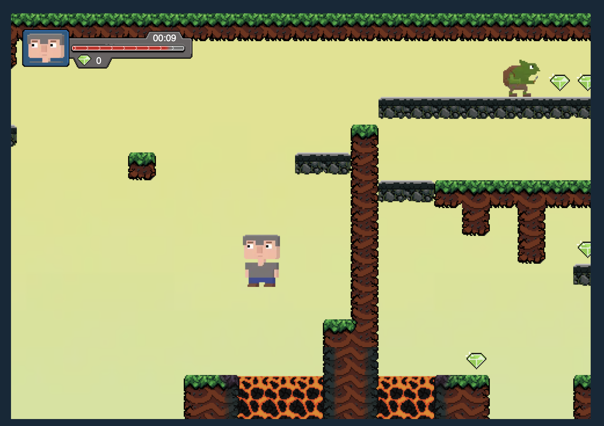
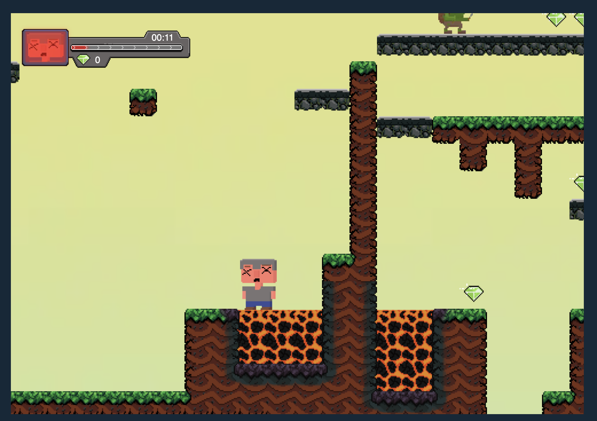

# 💎 Bob's Day Crushing Gobs 🎮

## About
A little platformer game made in vanilla Javascript without using canvas.

Levels are generated by reading a bitmap and assigning each pixel as a block or entity in the game world.

The block textures are assigned procedurally by looking at adjacent blocks and block types

## Controls
WASD to move, Space can also be used as a jump key.

Esc to pause/unpause

## 🛠 Installation & Setup

### 3) Start the web server
```bash
go run .
# alternatively:
go run server.go
```
### 4) Navigate to: 
```bash
http://localhost:8080/
```
### 5) Enjoy crushin' gobs & collecting gems!




## 🌟 Authors

-  **[Lukas Haavel (lhaavel)](https://01.kood.tech/git/lhaavel)**
-  **[Chris Laks (claks)](https://01.kood.tech/git/claks)**